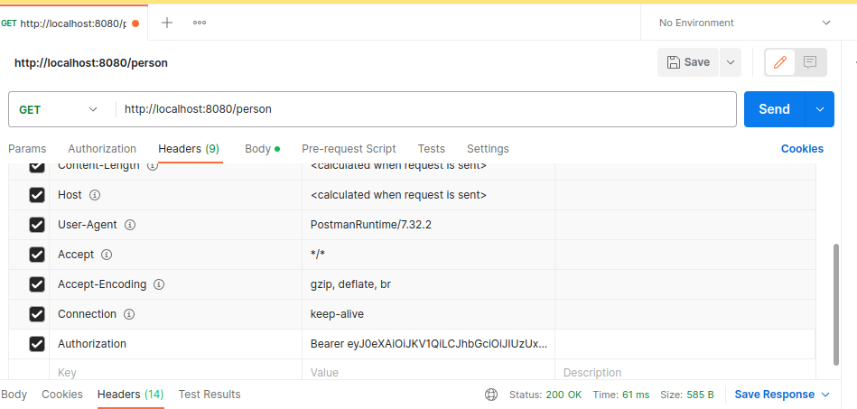

## Проект - Аутентификация Spring REST

### Использованные технологии

* Spring Boot 2.7.9
* PostgreSQL 15
* Lombok 
* JWT 4.3.0
* Liquibase 3.6.2
* Spring Security
* Maven 

### Требования к окружению

* Java 17
* Maven
* PostgreSQL 15
* Postman

### Запуск проекта 

1. Установить сервер БД PostgreSQL. При установке задать:
* Имя пользователя - postgres
* Пароль - postgres
* Порт - 5432
2. Создать БД с именем fullstack_auth
3. При помощи терминала перейдите в папку
с исходным кодом и выполните команду: mvn spring-boot:ru  

### Взаимодействие с проектом 

1. Открыть Postman
2. Для регистрации в сервисе необходимо отправить POST запрос 
по  http://localhost:8080/person

3. Для аутентификации в сервисе необходимо отправить POST запрос
http://localhost:8080/login 

4. В Header response вы получите уникальный токен для, который необходимо 
использовать для дальнейшего пользования - необходимо скопировать строку с токеном
(начинается с Bearer) и вставить в header в последующих запросах

5. Для просмотра всех пользователей в сервисе необходимо отправить GET запрос
http://localhost:8080/person

6. Для удаления пользователя по Id в сервисе необходимо отправить DELETE запрос
http://localhost:8080/person/${id}/

7. Для просмотра профиль пользователя в сервисе необходимо отправить GET запрос
http://localhost:8080/${id}/

8. Для изменения пароля пользователя в сервисе необходимо отправить PUT запрос
http://localhost:8080/person

### Контакты
vithag97@mail.ru